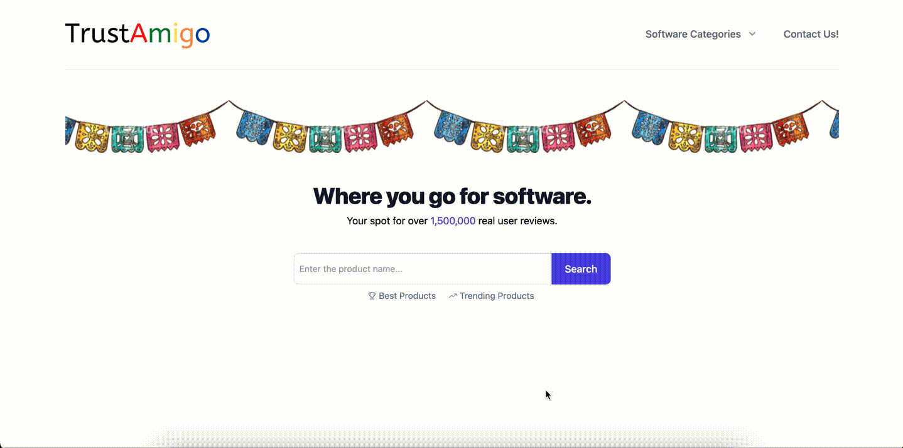

## TrustAmigo

TrustAmigo is a platform where users can view and submit reviews on all things software.

## Technology Used

Full stack application split into 3 docker containers:

- Database: Postgres
- Sever: Python Flask
- Front-end: React.js

Dev and prod environments configured with seperate entrypoint.sh, dockerfiles, and databases ready to go.

- Dev: on startup entrypoint.sh clears, creates, and seeds a dev database.
- Prod: on startup entrypoint.prod.sh does not disrupt existing prod database. Prod uses NGINX to handle proxying.

## GIF Demos

Search for a company from the home page.

