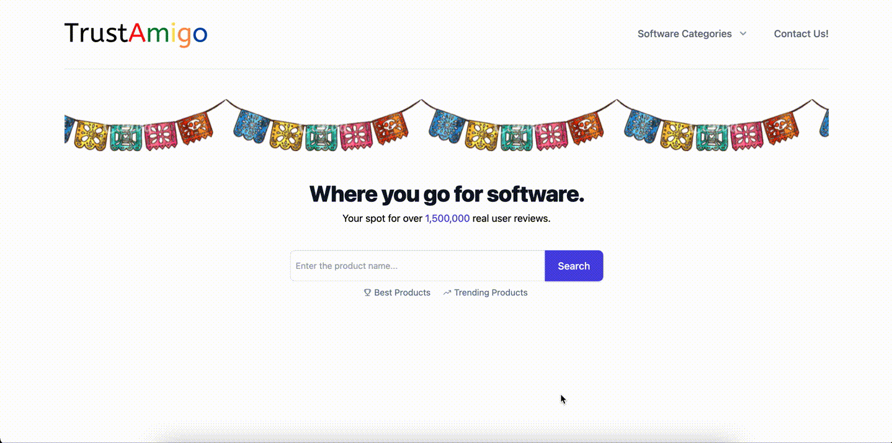
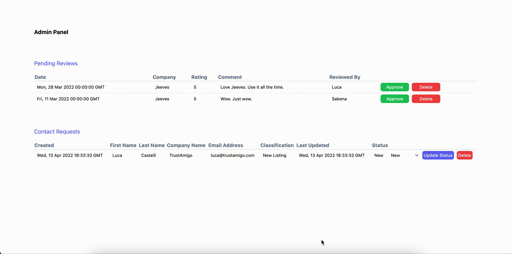

## TrustAmigo

TrustAmigo is a platform where users can view and submit reviews on all things software.

## Technology Used

Full stack application split into 3 docker containers:

- Database: Postgres
- Sever: Python Flask
- Front-end: React.js

Dev and prod environments configured with seperate entrypoint.sh, dockerfiles, and databases ready to go.

- Dev: on startup entrypoint.sh clears, creates, and seeds a dev database.
- Prod: on startup entrypoint.prod.sh does not disrupt existing prod database. Prod uses NGINX to handle proxying.

The application uses company data from Crunchbase's API. The free version only allows for a sample data download, so it's currently reading that in as a CSV. Ideally, with a paid subscription, the application would make periodic HTTP REST calls directly to the Crunchbase API using AppScheduler.

I realize I should have certain files in my .gitignore such as the .env files, but given it's a project application with no real data or API keys, it's alright.

## GIF Demos

Search for a company from the home page and view it's profile.

Alternatively, search for software companies based on a category.

Write a review.

Review won't show up on the profile right away, it'll need to verified by a TrustAmigo customer service rep first - which can be done from the admin panel.

If you need to contact TrustAmigo for any reason - whether that be to inquire of a new listing or an exisitng listing. Fill out a contact form.

The inquiry won't go unanswered as it'll appear in the admin panel for a TrustAmigo customer service rep to action and update its status accordingly.

